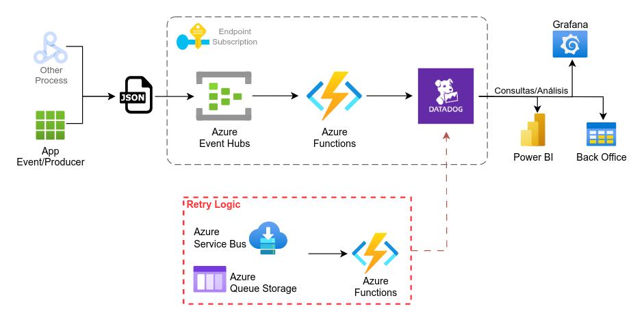

# azure-event-to-datadog

Consumo de Logs/Event utilizando **Azure Event Hub** y **Azure Function**.

Se debe definir el número de particiones y la política de retención en Azure Event Hub. Azure Function que se despierte con un trigger de Event Hub para almacenar los datos en Datadog.

**Escalabilidad** y **Seguridad** provista por servicios en Azure. 

**Manejo de Errores** (Retry Logic)  
Considerar una arquitectura donde los eventos que no se pueden enviar se coloquen en una cola (como Azure Queue Storage) para su reintento más tarde, en lugar de registrarlos y perderlos.

Azure Queue Storage o Azure Service Bus, para almacenar los eventos que no se pudieron enviar. Contar con otra Azure Function que lea de esta cola y vuelva a intentar enviar los eventos a Datadog.

## POC

TODO
