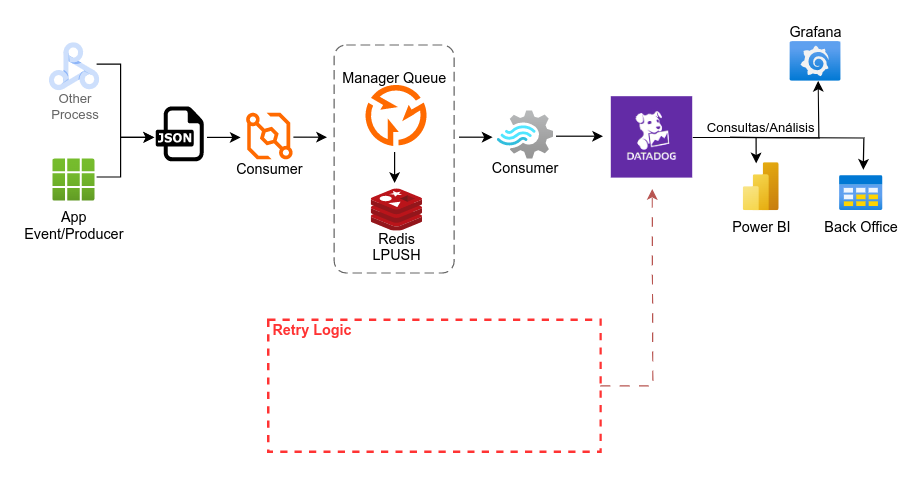

# event-redispush-datadog

Registra eventos de archivos json en sistema Queue (Redis LPUSH/RPUSH). Utiliza Publicar/Suscribir para  enviar mensajes a un canal específico. El Consumidor se conecta a una base de datos Datadog almacenando el objeto json.

**Escalabilidad**: Se puede implementar múltiples instancias de consumidores para aumentar el throughput del procesamiento de eventos.

**Manejo de Errores**: Agregar manejo de errores en el consumidor para reintentar envíos a Datadog en caso de fallo, y considerar una estrategia para gestionar mensajes que no puedan ser procesados.

**Seguridad**: Aplicar seguridad en las conexiones de Redis y Datadog, utilizando credenciales y llaves seguras.

Flujo de Datos
**App Event/Producer** (netcore) envía archivos JSON desde el directorio `json_files` a **Producer**.  
**Producer** (python) toma esos datos y los envía a canal de **Redis**.  
**Consumer** (python) lee los datos de canal de **Redis**.  
**Consumer** envía los datos procesados al **Datadog** Agent para su monitoreo.

Arquitectura on-premise



>NOTA: También se diseña una solución en Cloud de con los servicios de Azure
>* [Azure Consumo de Logs/Event](AZURE-ARQ.md)

## Detalles

Redis actúa como middleware, almacenando y gestionando la comunicación entre el Producer y Consumer.
El agente de Datadog recibe métricas del Consumer, lo que permite el monitoreo centralizado.

Manager Queue debería gestionar el trafico de peticiones y los errores de eventos que no pueden ser procesados (enviar a `Retry Logic`) 

## Objetivos

Desacoplar registros de logs y administrar como eventos dentro de arquitectura para guardarlos en base de datos Datadog.

## Run

* https://docs.datadoghq.com/tracing/guide/tutorial-enable-java-containers/

Ejecutar instancia de [datadog/agent:7.28.0](https://hub.docker.com/r/datadog/agent/tags) local

```sh
# Net for datadog
docker network create --driver=bridge --subnet=192.164.112.0/16 datadog-net

# Up datadog local
docker-compose -f datadog.yaml up
```

Construir y Ejecutar cada instancia

>NOTA: A modo de desarrollo existe un docker-compose.yaml que construye y ejecuta la instancias.
>```sh
>docker-compose up --build
>```

```sh
# Queue (redis)
# ​​docker run -it --network some-network --rm redis redis-cli -h some-redis
# Start with persistent storage
# docker run --name redis:alpine -d redis redis-server --save 60 1 --loglevel warning
docker run --rm -d --name queue \
  -p 6379:6379 \
  redis:alpine

# IP de maquina en ejecución
export IP_LOCAL=$(ip addr | grep 'inet.*global dynamic' | awk  {'split($2,r,"/");print r[1]'})

# Producer in Queue
docker build -t local/event/producer:dev ./producer
docker run --rm -d --name producer \
  -p 5000:5000 \
  -e REDIS_HOST=$IP_LOCAL \
  local/event/producer:dev

# Consumer in Queue (--add-host $HOSTNAME:127.0.0.1)
# DEV mode consumer
# env DATADOG_API_KEY=3c0c3965368a6b10f7640dbda46abfd2 DATADOG_HOST=192.164.112.5 python3 ./consumer/consumer.py
docker build -t local/event/consumer:dev ./consumer
docker run --rm --network="host" --name consumer \
  -e REDIS_HOST=$IP_LOCAL \
  -e DATADOG_API_KEY=3c0c3965368a6b10f7640dbda46abfd2 \
  -e DATADOG_HOST=192.164.112.5 \
  -e PYTHONUNBUFFERED=1 \
  local/event/consumer:dev

# App event
docker build -t local/event/app:dev ./app-producer
docker run --rm --name app \
  -p 5001:5000 \
  -e PRODUCER_HOST=$IP_LOCAL \
  -v $PWD/app-producer/json_files:/app/json_files \
  local/event/app:dev
```

## Test

Datadog test

```sh
curl -X GET http://localhost:8126/info

# Send traces to the Agent by API
export DD_API_KEY=3c0c3965368a6b10f7640dbda46abfd2
export DD_APP_KEY=my-app-key-to-datadog

curl -X PUT "http://localhost:8126/v0.3/traces" \
-H "Content-Type: application/json" \
-H "DD-API-KEY: ${DD_API_KEY}" \
-H "DD-APPLICATION-KEY: ${DD_APP_KEY}" \
-d @- << EOF
[
  [
    {
      "duration": 12345,
      "name": "span_name",
      "resource": "/home",
      "service": "service_name",
      "span_id": 987654321,
      "start": 0,
      "trace_id": 123456789,
      "meta": {  
        "env": "development",  
        "version": "1.0"  
      } 
    }
  ]
]
EOF

# $(date +%s)
curl -X PUT "http://localhost:8126/v0.3/traces" \
-H "Content-Type: application/json" \
-H "DD-API-KEY: ${DD_API_KEY}" \
-d @- << EOF
[
  [
    {
    "title": "Nuevo evento recibido",
    "event": {
        "duration": 12345,
        "name": "span_name",
        "resource": "/home",
        "service": "service_name",
        "span_id": 987654321,
        "start": 0,
        "trace_id": 123456789,
        "meta": {  
          "env": "development",  
          "version": "1.0"  
        }
    },
    "date_happened": "1732521750",
    "priority": "normal"
    }
  ]
]
EOF
```

## TODO

* Manejo de Errores
* Seguridad
* Escalamiento (K8s HPA, Docker Swarm)
* Test de estrés